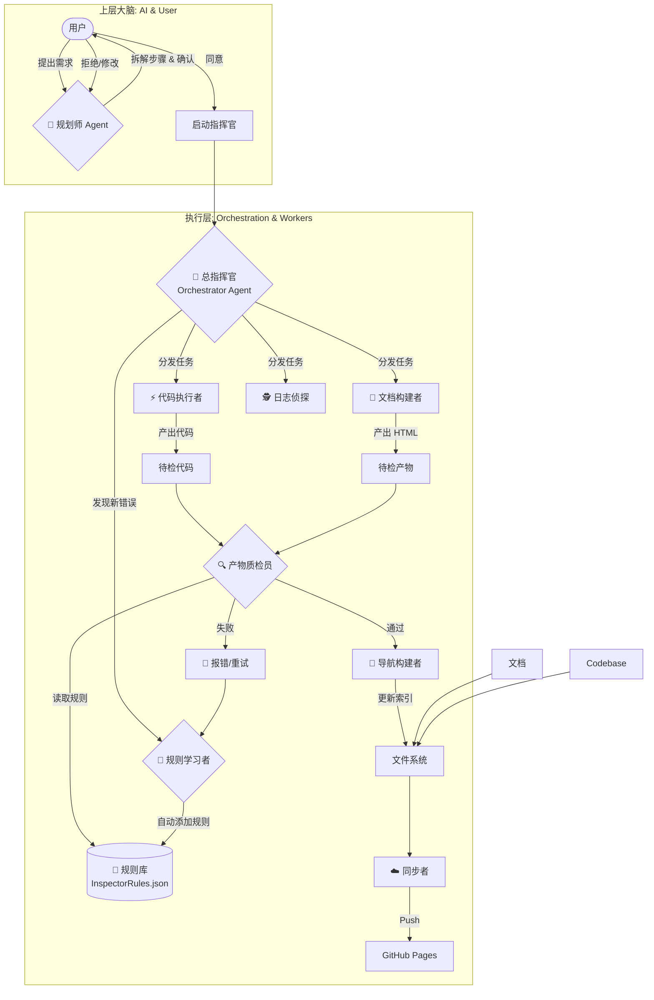

# 🤖 多 Agent 协同与工作流架构图
本文档描述了当前项目自动化系统（Auto-Pilot）的架构、角色分工及工作流程。
---
## 1. 系统概览 (Architecture Overview)
本系统采用 **Hybrid Intelligence (混合智能)** 架构，将 AI 的认知能力与脚本的自动化执行能力结合。
*   **上层大脑 (Cognitive Layer)**: 由 GitHub Copilot 扮演，负责**Plan (拆解)** 和 **Execute (执行)**。
*   **执行层 (Execution Layer)**: 由 Orchestrator 及各个执行者脚本扮演，负责具体的任务执行。

---
## 2. 角色详解 (Agent Roles)
### A. 认知层角色 (由 LLM 承担)
#### 🧠 1. 规划师 (Planner Agent)
*   **载体**: GitHub Copilot (Plan Mode)
*   **智力等级**: ⭐⭐⭐⭐⭐
*   **职责**:
    *   **深度思考**: 面对模糊需求（如“设计物理系统”），进行上下文调研。
    *   **拆解任务**: 将大目标分解为若干个不可分割的原子操作步骤。
    *   **输出**: 制定 `Step-by-step Plan`，指导执行者行动。
#### ⚡ 2. 执行者 (Executor Agent)
*   **载体**: GitHub Copilot (Agent Mode)
*   **智力等级**: ⭐⭐⭐⭐
*   **职责**:
    *   **落地实现**: 根据规划师的蓝图，实际编写 C# 代码或 PowerShell 脚本。
    *   **工具调用**: 主动调用编辑器工具（Edit/Create File）修改项目。
    *   **即时修正**: 遇到编译错误时，自动尝试修复。
---
### B. 执行层角色 (由脚本承担)
#### 🤖 3. 总指挥官 (The Orchestrator)
*   **脚本**: `Scripts/TaskOrchestrator.ps1`
*   **智力等级**: ⭐⭐⭐
*   **职责**:
    *   **监听**: 24小时监控项目文件变更。
    *   **决策**: 读取 `ProjectIntent.json`，决定是否响应，以及派谁响应。
    *   **调度**: 使用 `Start-Job` 并行启动子 Agent，避免阻塞主线程。
#### ⚡ 4. 代码执行者 (Coder)
*   **脚本**: (逻辑集成在 Orchestrator 中，调用编译执行工具)
*   **智力等级**: ⭐⭐⭐
*   **职责**:
    *   **编写代码**: 根据规划师的指示，编写和修改代码文件。
    *   **自动修复**: 对常见错误（如语法错误）进行自动修复。
#### 👷 5. 文档构建者 (DocBuilder)
*   **脚本**: `Scripts/Agent_DocBuilder.ps1`
*   **智力等级**: ⭐⭐
*   **职责**:
    *   **转换**: 将 Markdown 转换为带有样式的静态 HTML。
    *   **增量构建**: 只处理变更的文件，速度极快。
    *   **兼容性**: 确保生成的 HTML 可以在本地 `file://` 协议下直接打开。
#### 🧭 6. 导航员 (Navigator)
*   **脚本**: `Scripts/Agent_Navigator.ps1`
*   **智力等级**: ⭐⭐
*   **职责**:
    *   **扫描**: 遍历 `KnowledgeBase/` 和 `html/` 目录。
    *   **索引**: 生成 JSON 格式的 `window.SITE_NAV` 数据。
    *   **更新**: 确保网页侧边栏永远显示最新的文件列表。
#### 🔍 7. 质检员 (Inspector)
*   **脚本**: `Scripts/Agent_Inspector.ps1` (实际调用 `Inspector_Doc.ps1` 等专职脚本)
*   **配置文件**: `Scripts/InspectorRules.json` (动态规则库)
*   **智力等级**: ⭐⭐⭐
*   **职责**:
    *   **通用验证**: 检查产物完整性（如 HTML 是否为空）。
    *   **规则匹配**: 根据 json 库中的正则规则，扫描文件内容。
    *   **自我修正**: 每次发现的新错误模式，都会被添加到规则库中，确保**绝不再犯**。
#### 🧠 8. 规则学习者 (Learner)
*   **概念**: 一个反馈闭环机制。
*   **职责**:
    *   **记录错误**: 当人工发现生成的文档有错时，提取错误特征（如 `<br>` 导致渲染失败）。
    *   **更新规则**: 将该特征写入 `InspectorRules.json`，并附上修复建议。
#### ☁️ 9. 同步者 (Syncer)
*   **脚本**: `Scripts/SyncDocs.ps1`
*   **智力等级**: ⭐⭐
*   **职责**:
    *   **同步**: 将本地通过质检的文件及索引推送到 GitHub。
    *   **发布**: 让团队其他成员或网页访问者能看到最新的文档。
#### 🕵️ 10. 日志侦探 (LogDetective)
*   **脚本**: (逻辑集成在 Orchestrator 中，调用分析工具)
*   **智力等级**: ⭐⭐⭐⭐
*   **职责**:
    *   **发现**: 自动检测新产生的 `fishing_phy_log_*.txt`。
    *   **分析**: 自动调用 `Scripts/AnalyzeJitter.ps1` 等工具进行数据挖掘。
    *   **报告**: 生成可视化的 HTML 报表。
---
## 3. 工作流程示例 (Workflows)
### 场景 A: 编写技术文档
当你修改了 `KnowledgeBase/MyDoc.md` 并保存：
1.  **Orchestrator** 收到 `Changed` 事件。
2.  检查 `ProjectIntent.json` -> `DocBuilder.enabled = true`。
3.  启动 **DocBuilder** 任务 -> 生成 `MyDoc.html`。
4.  HTML 生成后，**Orchestrator** 触发 **Inspector** 进行质检。
5.  **Inspector** 确认页面无 "Error" 且包括有效内容。
6.  **Orchestrator** 根据质检结果启动 **Navigator**。
7.  **Navigator** 更新 `site_nav.js`。
8.  **Orchestrator** 启动 **Syncer**，自动将变更推送到 GitHub。
9.  **Refresh**: 你刷新本地或远程浏览器验证结果。
### 场景 B: 调试物理抖动
当你运行游戏并产出了 `fishing_phy_log_123.txt`：
1.  **Orchestrator** 收到 `Created` 事件。
2.  识别文件名匹配 `fishing_phy_log_*.txt`。
3.  检查 `ProjectIntent.json` -> `LogDetective.enabled = true`。
4.  自动调用分析脚本。
5.  生成 `html/AnalyzeJitter_Report.html`。
6.  **Navigator** 将新报表加入侧边栏。
7.  **Click**: 你在网页中直接点击查看分析结果。
---
## 4. 意图配置 (Intent Configuration)
这套系统的核心在于 `ProjectIntent.json`。你可以随时调整它来改变 AI 的工作重心。
```json
{
    "current_mode": "Development",
    "agents_config": {
        "DocBuilder": { "enabled": true },
        "Inspector": { "enabled": true, "strict_mode": true },
        "Navigator": { "enabled": true },
        "Syncer": { "enabled": false },
        "LogDetective": { "enabled": false }
    }
}
```
